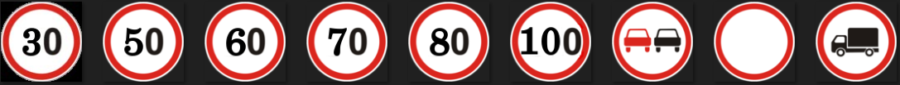
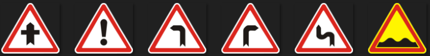
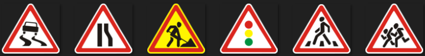
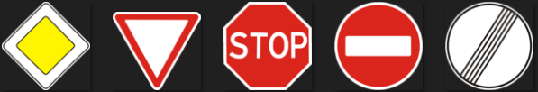
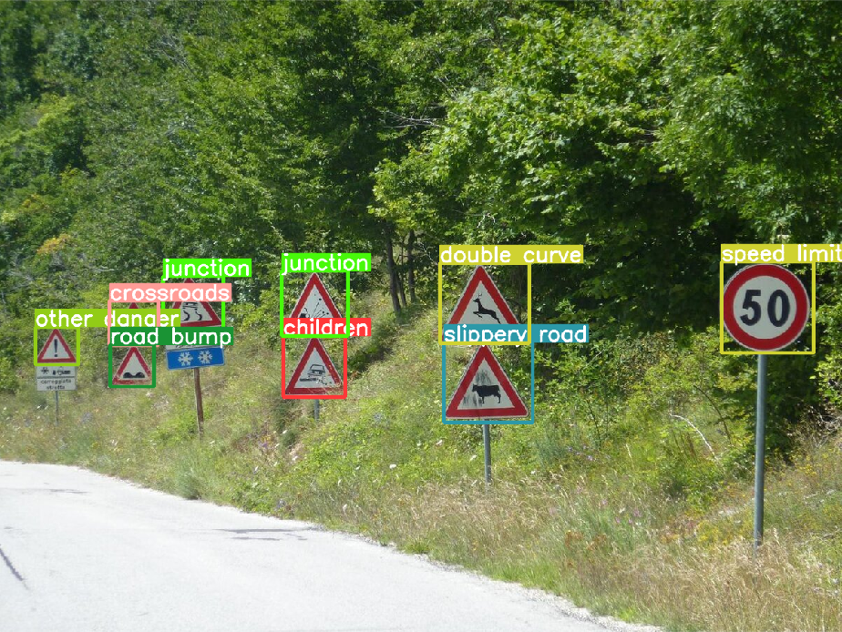

# Traffic sign detection and classification using [YOLOv8](https://docs.ultralytics.com)

## Datasets
 - for detection > [Traffic Signs Dataset in YOLO format](https://www.kaggle.com/datasets/valentynsichkar/traffic-signs-dataset-in-yolo-format)
 - for classification > [GTSRB - German Traffic Sign Recognition Benchmark](https://www.kaggle.com/datasets/meowmeowmeowmeowmeow/gtsrb-german-traffic-sign)

## Train
 - training process is not shown
 - some areas of the datasets are modified and not fully used
 - you can see only detection train [results](https://github.com/Saidislombek-dev/traffic_sign_detection/tree/main/detection_train)
 - traffic signs are detect in the following four groups

### These are:
 1. prohibitory
 
 
 
 2. danger
 
 
 
 
 
 3. mandatory
 
 
 
 
 
 4. other
 
 

### Note: Detection model can detect many signs but classification model can be divided into the classes shown in the picture above!

## Test
 - [Main file](Main.ipynb) shows the usage of the model
 - you can check your test file yourself
 - code is also written for the file in video format

## Example

### **That's why it find some character names wrong in the example picture
